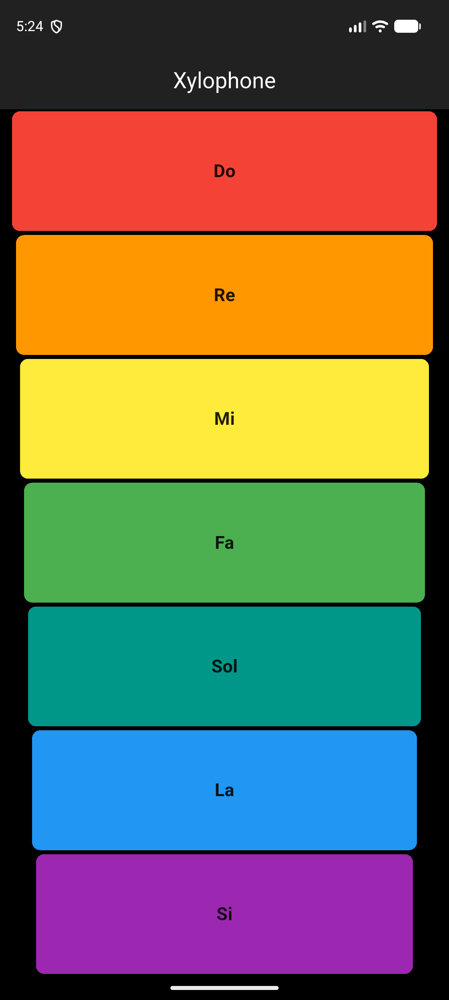

# Lab 5: Xylophone

Đàn Xylophone 7 phím màu, mỗi phím phát một nốt nhạc (Do → Si).

## Chức năng

- Dùng package `audioplayers` phát file `assets/note1..7.wav`.
- Hàm `playSound(int noteNumber)` nhận số thứ tự phím.
- `Expanded` + `TextButton` với màu sắc khác nhau; hiệu ứng sáng lên khi nhấn.

## Cấu trúc chính

- `lib/main.dart`
- `assets/note1.wav … note7.wav`

## Chạy ứng dụng

```bash
flutter pub get
flutter run
```

## Demo


